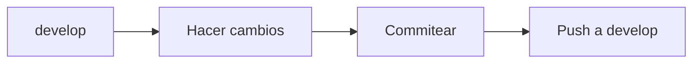
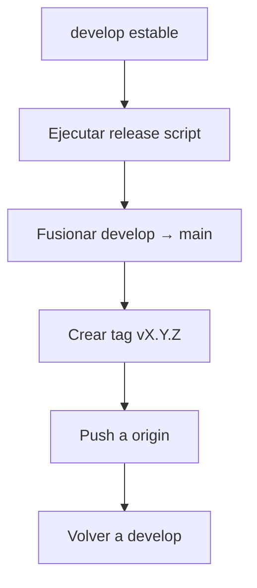

# 🚀 Flujo de Trabajo Git - AutoParts Manager

## 📋 Índice
- [Estrategia de Ramas](#estrategia-de-ramas)
- [Flujo de Desarrollo](#flujo-de-desarrollo)
- [Sistema de Versionado](#sistema-de-versionado)
- [Comandos Útiles](#comandos-útiles)
- [Ejemplos Prácticos](#ejemplos-prácticos)

---

## 🌿 Estrategia de Ramas

### Ramas Principales

#### `main` - Rama de Producción 🔒
- **Propósito**: Contiene únicamente versiones estables y probadas
- **Protección**: ⛔ **NUNCA se sube código directamente a esta rama**
- **Actualizaciones**: Solo mediante merge desde `develop` durante un release
- **Etiquetas**: Cada commit en main está etiquetado con una versión (v1.0.0, v1.0.1, etc.)

#### `develop` - Rama de Desarrollo 🛠️
- **Propósito**: Rama principal de desarrollo diario
- **Uso**: Todo el trabajo nuevo se integra aquí primero
- **Estado**: Refleja el trabajo en progreso más reciente
- **Origen**: Todas las ramas de feature parten de aquí

### Ramas Secundarias (Opcionales)

#### `feature/*` - Nuevas Funcionalidades ✨
```bash
git checkout develop
git checkout -b feature/nueva-funcionalidad
# ... trabajar en la funcionalidad ...
git checkout develop
git merge feature/nueva-funcionalidad
git branch -d feature/nueva-funcionalidad
```

#### `hotfix/*` - Correcciones Urgentes 🔥
```bash
git checkout main
git checkout -b hotfix/correccion-critica
# ... corregir el error ...
git checkout main
git merge hotfix/correccion-critica
git checkout develop
git merge hotfix/correccion-critica
git branch -d hotfix/correccion-critica
```

---

## 🔄 Flujo de Desarrollo

### Día a Día (Trabajo Normal)



**Comandos:**
```bash
# 1. Asegurarte de estar en develop
git checkout develop

# 2. Hacer cambios en el código
# ... editar archivos ...

# 3. Revisar cambios
git status
git diff

# 4. Agregar archivos
git add .

# 5. Commitear con mensaje descriptivo
git commit -m "feat: agregar nueva funcionalidad X"

# 6. Subir a develop
git push origin develop
```

### Publicar una Nueva Versión (Release)



**Comandos:**
```bash
# Opción 1: Usar npm scripts (RECOMENDADO)
npm run release:patch   # Para correcciones (1.0.0 → 1.0.1)
npm run release:minor   # Para nuevas funcionalidades (1.0.0 → 1.1.0)
npm run release:major   # Para cambios importantes (1.0.0 → 2.0.0)

# Opción 2: Ejecutar script directamente
.\scripts\release.ps1 -Type patch
.\scripts\release.ps1 -Type minor
.\scripts\release.ps1 -Type major
```

---

## 📦 Sistema de Versionado

### Versionado Semántico (SemVer)

Formato: `MAJOR.MINOR.PATCH` (ejemplo: `v1.2.3`)

```
v1.2.3
│ │ │
│ │ └─── PATCH: Corrección de errores (bugs) 🐛
│ │      Incrementa cuando solo corriges errores sin agregar funcionalidad
│ │      Ejemplo: 1.0.0 → 1.0.1
│ │
│ └───── MINOR: Nueva funcionalidad compatible ✨
│        Incrementa cuando agregas funcionalidad SIN romper compatibilidad
│        Ejemplo: 1.0.0 → 1.1.0
│
└─────── MAJOR: Cambios incompatibles 💥
         Incrementa cuando haces cambios que rompen compatibilidad
         Ejemplo: 1.0.0 → 2.0.0
```

### ¿Cuándo usar cada tipo?

#### 🐛 PATCH (1.0.0 → 1.0.1)
Usa cuando:
- Corriges un error que no afecta la funcionalidad
- Arreglas un bug reportado
- Mejoras de rendimiento menores
- Actualizaciones de documentación

**Ejemplo:**
```bash
# Corregiste un error en el cálculo del IVA
npm run release:patch
```

#### ✨ MINOR (1.0.0 → 1.1.0)
Usa cuando:
- Agregas una nueva funcionalidad
- Añades nuevos endpoints a la API
- Implementas una nueva página o componente
- Todo sigue funcionando como antes (compatible)

**Ejemplo:**
```bash
# Agregaste módulo de reportes de ventas
npm run release:minor
```

#### 💥 MAJOR (1.0.0 → 2.0.0)
Usa cuando:
- Cambias la estructura de la base de datos
- Modificas endpoints existentes de manera incompatible
- Reescribes una parte importante del sistema
- Cambios que requieren actualización de clientes

**Ejemplo:**
```bash
# Cambiaste el formato de respuesta de la API
npm run release:major
```

---

## 🛠️ Comandos Útiles

### Ver Información de Versiones

```bash
# Ver todas las versiones (tags)
git tag -l

# Ver todas las versiones con orden
git tag -l --sort=-v:refname

# Ver detalles de una versión específica
git show v1.0.0

# Ver cambios entre dos versiones
git diff v1.0.0 v1.1.0

# Ver historial con ramas y tags
git log --oneline --graph --all --decorate
```

### Trabajar con Ramas

```bash
# Ver todas las ramas (locales y remotas)
git branch -a

# Cambiar de rama
git checkout develop
git checkout main

# Crear nueva rama desde develop
git checkout develop
git checkout -b feature/mi-nueva-funcion

# Eliminar rama local
git branch -d feature/mi-nueva-funcion

# Actualizar rama local con cambios remotos
git pull origin develop
```

### Deshacer Cambios

```bash
# Deshacer cambios no commiteados
git restore archivo.js

# Deshacer todos los cambios no commiteados
git restore .

# Deshacer último commit (mantener cambios)
git reset --soft HEAD~1

# Ver qué cambió en el último commit
git show HEAD
```

---

## 📚 Ejemplos Prácticos

### Escenario 1: Agregando una nueva funcionalidad

```bash
# 1. Asegurarte de estar en develop actualizado
git checkout develop
git pull origin develop

# 2. Crear rama de feature (opcional pero recomendado)
git checkout -b feature/modulo-clientes

# 3. Hacer cambios y commits
# ... editar archivos ...
git add .
git commit -m "feat: agregar CRUD de clientes"

# 4. Volver a develop y fusionar
git checkout develop
git merge feature/modulo-clientes

# 5. Subir a develop
git push origin develop

# 6. Eliminar rama de feature
git branch -d feature/modulo-clientes

# 7. Cuando esté listo para producción
npm run release:minor
```

### Escenario 2: Corrigiendo un error

```bash
# 1. Estar en develop
git checkout develop

# 2. Hacer la corrección
# ... editar archivos ...
git add .
git commit -m "fix: corregir cálculo de inventario"

# 3. Subir cambios
git push origin develop

# 4. Publicar versión de corrección
npm run release:patch
```

### Escenario 3: Volviendo a una versión anterior

```bash
# Ver versiones disponibles
git tag -l

# Ver diferencias con versión anterior
git diff v1.0.0 v1.1.0

# Crear rama desde una versión específica
git checkout -b hotfix-from-v1.0.0 v1.0.0

# O simplemente ver el código de esa versión
git checkout v1.0.0
# Cuando termines de ver
git checkout develop
```

### Escenario 4: Revisando el historial

```bash
# Ver historial gráfico completo
git log --oneline --graph --all --decorate

# Ver cambios de la última versión
git show v1.0.0

# Ver archivos cambiados en una versión
git diff --name-only v1.0.0 v1.1.0

# Ver quién cambió qué archivo
git blame package.json
```

---

## 🎯 Mejores Prácticas

### Commits Descriptivos

Usa el formato **Conventional Commits**:

```bash
feat: agregar módulo de reportes
fix: corregir error en cálculo de IVA
docs: actualizar README con instrucciones
style: formatear código según estándar
refactor: reestructurar componente Sidebar
test: agregar pruebas para módulo ventas
chore: actualizar dependencias
```

### Frecuencia de Releases

- **PATCH**: Cuando sea necesario (correcciones urgentes)
- **MINOR**: Cada 1-2 semanas (nuevas funcionalidades)
- **MAJOR**: Solo para cambios importantes planificados

### Protección de Ramas

Configura en GitHub:
1. Ve a Settings → Branches
2. Agrega regla para `main`:
   - ✅ Require pull request reviews before merging
   - ✅ Require status checks to pass before merging
   - ✅ Include administrators

---

## 🆘 Troubleshooting

### "No estoy en la rama develop"
```bash
git checkout develop
```

### "Tengo cambios sin commitear"
```bash
git status
git add .
git commit -m "feat: descripción de cambios"
```

### "El script de release falla"
```bash
# Verificar que estás en develop
git branch

# Verificar que no hay cambios pendientes
git status

# Verificar que develop está actualizado
git pull origin develop
```

### "Quiero cancelar un release a medias"
```bash
# Si estás en main
git checkout develop

# Si hay merge en progreso
git merge --abort

# Si hay tag creado pero no subido
git tag -d v1.0.0
```

---

## 📞 Soporte

Si tienes dudas o problemas:
1. Revisa esta documentación
2. Ejecuta `git status` para ver tu estado actual
3. Consulta el historial con `git log --oneline --graph --all`

---

**Última actualización**: Octubre 7, 2025
**Versión del documento**: 1.0.0
